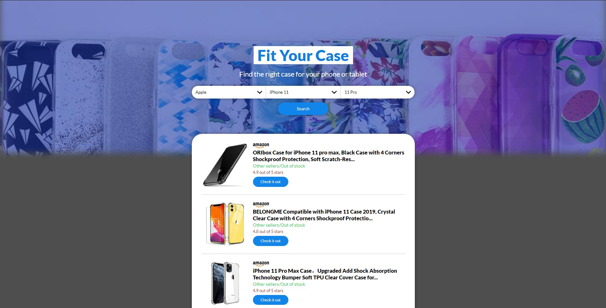

# Fit Your Case Website
> Web scraping in Amazon using node-fetch and cheerio
> #### FIRSTLY WILL LOAD SLOW, ONCE IS CACHED WILL BE FASTER

## Technologies
- Node.js
- Redis
- Typescript
- Cheerio

## How to deploy this website

### Requirements
- Docker 19+

### Instructions
1. Clone the repo
```bash
$ git clone https://github.com/NovaJuan/fit-your-case.git
```

2. Go to the project folder
```bash
$ cd fit-your-case
```  

3. Use docker-compose
```bash
$ docker-compose up -d 
```

4. Open browser at port **5000**



> Version: 1.0.0

> Author: Juan Romero